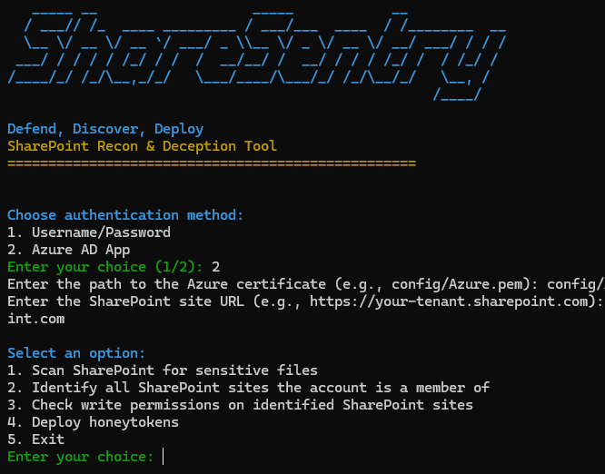

# SharePoint Security Tool for Recon and Deception

A security tool designed to search, scan, and deploy decoys across SharePoint environments. This tool helps security teams identify potential security risks, monitor unauthorized access attempts, and improving security posture in SharePoint.



## Features

- 🔍 **File Scanner**: Search across SharePoint sites for potentially sensitive files based on customizable keywords and patterns
- 🗺️ **Site Access Recon**: Identify all SharePoint sites accessible to authenticated accounts
- ✍️ **Write Permission Analysis**: Detect SharePoint spaces where the authenticated account has write access
- 🍯 **Honeytoken Deployment**: Automatically deploy customizable honey tokens across writable SharePoint spaces

## Prerequisites

- Python
- SharePoint Online Access
- Appropriate SharePoint permissions for deployment of decoys
- [Office365-REST-Python-Client](https://github.com/vgrem/Office365-REST-Python-Client) library

## Installation

1. Clone the repository:
```bash
git clone https://github.com/pwnpy/ShareSentry.git
cd ShareSentry
```

2. Install required packages:
```bash
pip install -r requirements.txt
```

3. Set up environment variables:

You need to have one of the following OS env variables for authentication

For Username/Password Authentication:
```env
SHAREPOINT_USERNAME=your_username@domain.com
SHAREPOINT_PASSWORD=your_password
```

For Azure App Authentication:
```env
AZURE_CLIENT_ID=your_client_id
AZURE_THUMBPRINT=your_certificate_thumbprint
AZURE_TENANT=your_tenant_id
```
The Certificate file path will be taken as inputs from the user

# Configuration
## KQL queries
The script will scan for a series of predefined queries aimed at identifying sensitive content. These queries are customizable and can be tailored to your organization's needs in the [queries](queries.md) file.


## Honey Tokens (decoys) setup
You can add or remove different honey tokens type of files and customise the wordlists file names from the `scripts/deploy_honeytokens.py` script.

### Wordlists (file naming)
Modify the keyword files in the `wordlists/` directory to customize decoy file names to your naming convention, for e.g.,
- `archive_filenames.txt`:  Archive file patterns
- `API_filenames.txt`: API related configuration files
- `config_filenames.txt`: Configuration file patterns
- `document_filenames.txt`: Documents (.docx, pdf, etc...) files
- ... (and other wordlist files)

### Templates
Customize honey token templates in the `templates/` directory:
```
templates/
├── template.bak
├── template.conf
├── template.csv
└── ... (other templates)
```

## Usage

1. Run the main script:
```bash
python main.py
```

2. Choose your authentication method:
```
Choose authentication method:
1. Username/Password
2. Azure App
```

3. Select operation mode:
```
Select an option:
1. Scan SharePoint for sensitive files
2. Identify all SharePoint sites the account is a member of
3. Check write permissions on identified SharePoint sites
4. Deploy honeytokens
5. Exit
```

## Output Files

The tool generates several output files:
```
output/
├── deployed_tokens.txt    # Log of deployed decoys assets
└── writable_spaces.txt    # Sites with write access
logs/
├── audit.log # Audit logs
```

## Blog Posts
check out the blog series on Medium:

1. **[SharePoint Recon - Scanning for Sensitive Content](https://medium.com/@pwnium/hidden-in-plain-sight-is-your-sharepoint-a-treasure-map-784f9f6d3c88)**  
2. **[SharePoint Recon - Mapping the Attack Surface](https://medium.com/@pwnium/sharepoint-recon-mapping-the-invisible-attack-surface-8f328ff35f4f)** 
3. **[Deploying Decoys in SharePoint](https://medium.com/@pwnium/deploying-deceptive-traps-in-sharepoint-for-active-defense-5d034038bfce)**

## Acknowledgments

- This project was made possible thanks to the work of the [Office365-REST-Python-Client](https://github.com/vgrem/Office365-REST-Python-Client) library.
  
- Thanks to the [LOLSearches](https://github.com/ZephrFish/LOLSearches) for providing KQL queries samples.
  
## Disclaimer

This tool is intended for authorized security testing only. Always ensure you have appropriate permissions before running security assessments on SharePoint environments.
